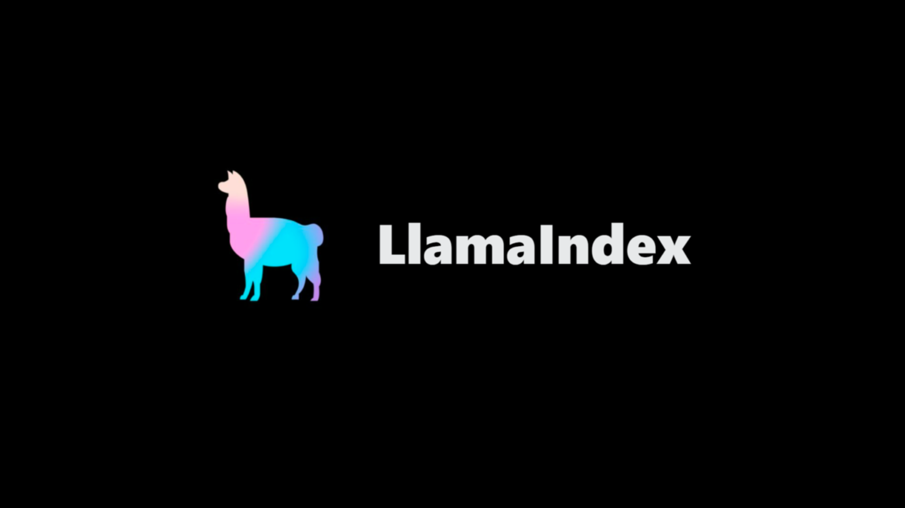

# 🤖 ChatBot Basic With Llama Index

Um chatbot simples e funcional que utiliza a biblioteca **Llama Index** para responder a perguntas de maneira interativa e eficiente. Construído com **Streamlit**, este chatbot é alimentado por um modelo de linguagem **Anthropic**, oferecendo respostas dinâmicas e adaptáveis.

---

## 📜 Descrição

Este projeto demonstra como integrar a biblioteca **Llama Index** com um modelo de linguagem avançado da **Anthropic** para criar um chatbot intuitivo. Ele inclui funcionalidades para ajustar a criatividade das respostas e manter ou limpar o histórico de conversas, tornando-o ideal para testes e personalização.

---

## ✨ Funcionalidades

- **Respostas Interativas:** Responde a perguntas do usuário com base em um modelo de linguagem Anthropic.
- **Ajuste de Criatividade:** Controle a criatividade das respostas ajustando a temperatura do modelo.
- **Histórico de Conversa:** O chatbot mantém um histórico de interação com o usuário.
- **Limpeza do Histórico:** Permite limpar o histórico de conversa a qualquer momento para reiniciar as interações.

---

## 📋 Requisitos

Certifique-se de ter as seguintes dependências instaladas:

- **Python:** Versão 3.8 ou superior.
- **Streamlit:** Versão 0.84 ou superior.
- **Llama Index:** Versão 0.1.0 ou superior.
- **Modelo Anthropic:** Consulte a [documentação do Llama Index](https://www.llamaindex.ai/) para mais detalhes.

---
